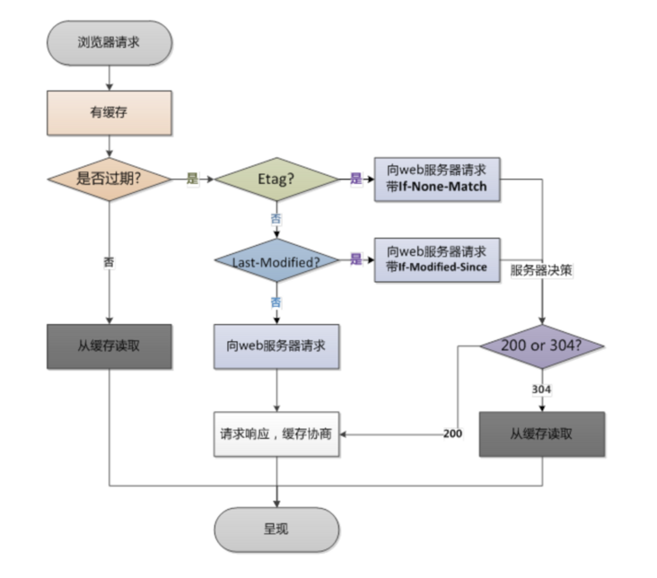

# 浏览器缓存分为强缓存和协商缓存，两者有两个比较明显的区别：

如果浏览器命中强缓存，则不需要给服务器发请求；而协商缓存最终由服务器来决定是否使用缓存，即客户端与服务器之间存在一次通信。
在 chrome 中强缓存（虽然没有发出真实的 http 请求）的请求状态码返回是 200 (from cache)；而协商缓存如果命中走缓存的话，请求的状态码是 304 (not modified)。 不同浏览器的策略不同，在 Fire Fox 中，from cache 状态码是 304.

# 请求流程

浏览器在第一次请求后缓存资源，再次请求时，会进行下面两个步骤：

- 浏览器会获取该缓存资源的 header 中的信息，根据 response header 中的 expires 和 cache-control 来判断是否命中强缓存，如果命中则直接从缓存中获取资源。
- 如果没有命中强缓存，浏览器就会发送请求到服务器，这次请求会带上 IF-Modified-Since 或者 IF-None-Match, 它们的值分别是第一次请求返回 Last-Modified 或者 Etag，由服务器来对比这一对字段来判断是否命中。如果命中，则服务器返回 304 状态码，并且不会返回资源内容，浏览器会直接从缓存获取；否则服务器最终会返回资源的实际内容，并更新 header 中的相关缓存字段。

# 强缓存

强缓存是根据返回头中的 Expires 或者 Cache-Control 两个字段来控制的，都是表示资源的缓存有效时间。

- Expires 是 http 1.0 的规范，值是一个 GMT 格式的时间点字符串，比如 Expires:Mon,18 Oct 2066 23:59:59 GMT 。这个时间点代表资源失效的时间，如果当前的时间戳在这个时间之前，则判定命中缓存。有一个缺点是，失效时间是一个绝对时间，如果服务器时间与客户端时间偏差较大时，就会导致缓存混乱。而服务器的时间跟用户的实际时间是不一样是很正常的，所以 Expires 在实际使用中会带来一些麻烦。
- Cache-Control 这个字段是 http 1.1 的规范，一般常用该字段的 max-age 值来进行判断，它是一个相对时间，比如 .Cache-Control:max-age=3600 代表资源的有效期是 3600 秒。并且返回头中的 Date 表示消息发送的时间，表示当前资源在 Date ~ Date +3600s 这段时间里都是有效的。不过我在实际使用中常常遇到设置了 max-age 之后，在 max-age 时间内重新访问资源却会返回 304 not modified ，这是由于服务器的时间与本地的时间不同造成的。当然 Cache-Control 还有其他几个值可以设置， 不过相对来说都很少用了：

  - no-cache 不使用本地缓存。需要使用协商缓存。
  - no-store 直接禁止浏览器缓存数据，每次请求资源都会向服务器要完整的资源， 类似于 network 中的 disabled cache。
  - public 可以被所有用户缓存，包括终端用户和 cdn 等中间件代理服务器。
  - private 只能被终端用户的浏览器缓存。
    如果 Cache-Control 与 Expires 同时存在的话， Cache-Control 的优先级高于 Expires 。

# 协商缓存

协商缓存是由服务器来确定缓存资源是否可用。 主要涉及到两对属性字段，都是成对出现的，即第一次请求的响应头带上某个字, Last-Modified 或者 Etag，则后续请求则会带上对应的请求字段 If-Modified-Since 或者 If-None-Match，若响应头没有 Last-Modified 或者 Etag 字段，则请求头也不会有对应的字段。

- Last-Modified/If-Modified-Since 二者的值都是 GMT 格式的时间字符串， Last-Modified 标记最后文件修改时间， 下一次请求时，请求头中会带上 If-Modified-Since 值就是 Last-Modified 告诉服务器我本地缓存的文件最后修改的时间，在服务器上根据文件的最后修改时间判断资源是否有变化， 如果文件没有变更则返回 304 Not Modified ，请求不会返回资源内容，浏览器直接使用本地缓存。当服务器返回 304 Not Modified 的响应时，response header 中不会再添加的 Last-Modified 去试图更新本地缓存的 Last-Modified， 因为既然资源没有变化，那么 Last-Modified 也就不会改变；如果资源有变化，就正常返回返回资源内容，新的 Last-Modified 会在 response header 返回，并在下次请求之前更新本地缓存的 Last-Modified，下次请求时，If-Modified-Since 会启用更新后的 Last-Modified。
- Etag/If-None-Match， 值都是由服务器为每一个资源生成的唯一标识串，只要资源有变化就这个值就会改变。服务器根据文件本身算出一个哈希值并通过 ETag 字段返回给浏览器，接收到 If-None-Match 字段以后，服务器通过比较两者是否一致来判定文件内容是否被改变。与 Last-Modified 不一样的是，当服务器返回 304 Not Modified 的响应时，由于在服务器上 ETag 重新计算过，response header 中还会把这个 ETag 返回，即使这个 ETag 跟之前的没有变化。

  <i>HTTP 中并没有指定如何生成 ETag，可以由开发者自行生成，哈希是比较理想的选择。</i>
